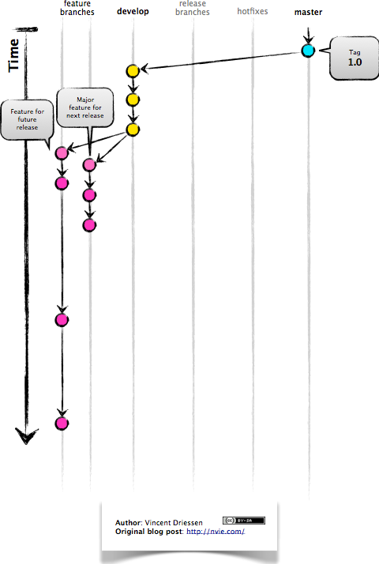
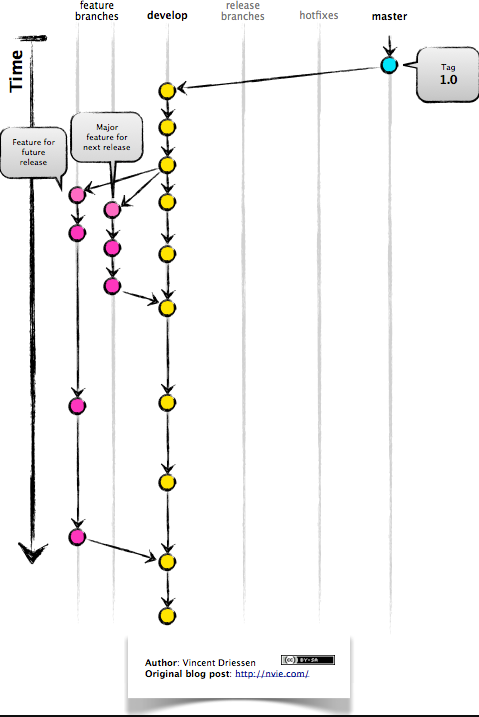
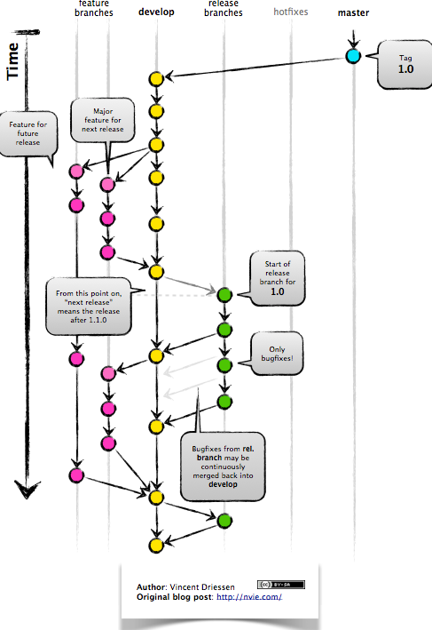
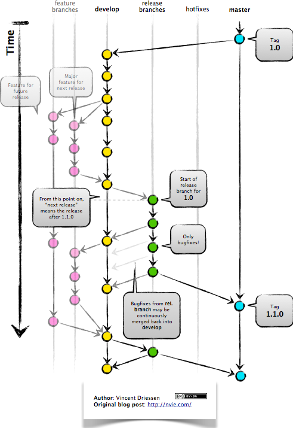
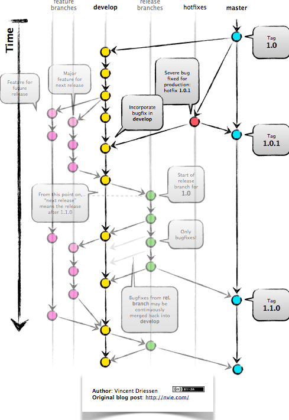

# Bem-vindo!

Neste artigo, exploraremos como utilizar o Git Flow para automatizar seu fluxo de trabalho de ramificação Git.

## O que é o Git Flow?

O Git Flow é uma metodologia para organizar o desenvolvimento com o Git, facilitando a gestão de ramificações e versionamento.

## Principais Benefícios

- **Desenvolvimento Paralelo:** Permitindo o desenvolvimento simultâneo de diferentes funcionalidades.
  
- **Colaboração:** Facilita a colaboração entre membros da equipe.

- **Área de Preparação de Liberação:** Permite preparar uma versão para ser lançada sem interromper o desenvolvimento.

- **Suporte para Correções de Emergência:** Possibilidade de criar correções de emergência de forma rápida.

## Como Funciona

Novo desenvolvimento (novos recursos, correções de bugs não emergenciais) são incorporados ramos de recursos:



Os ramos de características são ramificados fora da desenvelop ramo, e os recursos e correções acabados são mesclados de volta ao desenvelop ramo quando eles estão prontos para lançamento:



Quando é hora de fazer um lançamento, um ramo de liberação é criado a partir de desenvelop:



O código no ramificação de liberação é implantado em um ambiente de teste adequado, testado e quaisquer problemas são corrigidos diretamente no ramo de liberação. Este implantar - teste > - correção > - reimplantação > - reteste de > O ciclo continua até você ficar feliz que o lançamento seja bom o suficiente para ser lançado aos clientes.

Quando o lançamento terminar, o ramificação de liberação é fundido em master e para desenvelop também, para garantir que quaisquer alterações feitas no ramificação de liberação não são acidentalmente perdidos por novos desenvolvimentos.



O ramo master faixas liberadas apenas código. O único compromisso é mestre são fusões de solte ramos e ramificações de hotfix.

Ramos hotfix são usados para criar correções de emergência:



Eles são ramificados diretamente de uma liberação marcada no ramo mestre, e quando terminados são mesclados de volta em ambos mestre e desenvolver para se certificar de que o hotfix é acidentalmente perdido quando a próxima versão regular ocorre.

### Novo Desenvolvimento

Novos recursos e correções de bugs não emergenciais são incorporados em ramos de recursos, ramificando-se do ramo `develop`. Quando prontos, são mesclados de volta no ramo `develop`:

```bash
$ git flow feature start nova-feature
$ git flow feature finish nova-feature
```

### Área de Preparação de Liberação

Quando é hora de lançar, um ramo de liberação é criado a partir de develop

```bash
$ git flow release start 1.0.0
```
O código na ramificação de liberação é testado, corrigido e retestado até estar pronto para lançamento.

### Ramo Mestre

Quando a liberação é concluída, a ramificação de liberação é fundida no ramo master:

```bash
$ git flow release finish 1.0.0
```

O ramo master contém apenas código lançado.

### Ramos Hotfix

Para correções de emergência, ramos hotfix são criados diretamente do master:


```bash
$ git flow hotfix start correcao-emergencial
$ git flow hotfix finish correcao-emergencial
```

Os ramos hotfix são mesclados tanto em master quanto em develop.

Espero que essas informações sejam úteis para entender e implementar o Git Flow em seu projeto!


Certifique-se de ajustar as informações específicas, como a data, tags, e detalhes sobre as versões, de acordo com o seu contexto. Este é apenas um exemplo para começar.
