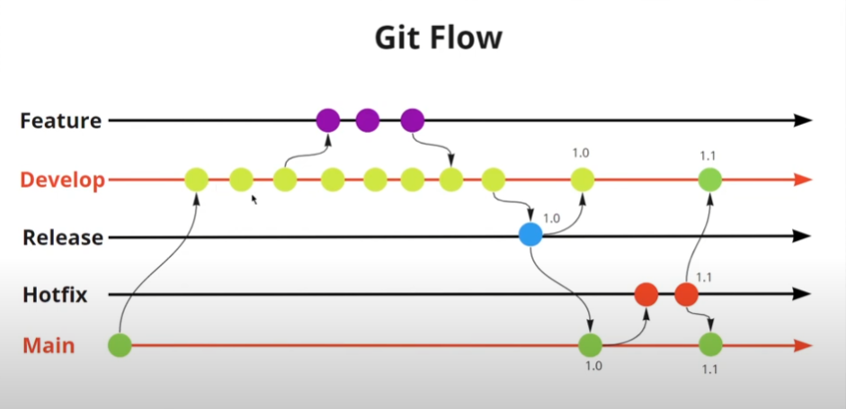

# Git flow 



Iniciando o git flow 


```
git flow init 
```

Branch de produção [main]
Branch de desenvolvimento [development] 
Branch de suporte [feature/]
Branch de bug [bugfix/] 
Branch de testes [release/] 
Branch de [hotfix/] 
Branch de suporte [support/]
Version tag prefix []


Summary of actions:
// Cria uma nova branch baseada na develop trazendo tudo para feature/css
- A new branch 'feature/css' was created, based on 'develop'
- You are now on branch 'feature/css'

Now, start committing on your feature. When done, use:

     git flow feature finish css

git flow feature start css 


Finalizando a branch feature 

git flow feature finish css 
